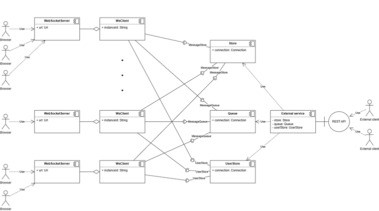

# only-chat Platform Documentation

only-chat is a platform for creating web applications to exchange text messages between users.

## Core Components

### 1. Transport
- Provides network communication between clients and the platform
- Interface is identical to the WebSocket interface
- WebSocket can be used as transport without modifications
- **Current implementation**: WebSocket (only implementation available)

### 2. Data Storage
- Provides persistent storage and retrieval of platform data:
  - Messages
  - Conversations
  - Connections
- **Current implementations**:
  - **Memory**: Data stored in application memory
  - **Elasticsearch**: Uses Elasticsearch server

### 3. User Storage
- Provides persistent storage of user data
- Handles user authentication and authorization
- Implementations are highly application-specific
- **Status**: No full-fledged implementations available

### 4. External Message Queue
- **Optional component**
- Enables:
  - Interaction between multiple messaging services
  - Delivery of messages/notifications to clients from external systems (e.g., via REST API)
- **Current implementation**: RabbitMQ (only implementation available)

### 5. Base Module (Client)
- Core system component
- Implements the logic for exchanging text messages between clients

## Technical Specifications

- **Interfaces**: All component interfaces are described in TypeScript definition files
- **Package**: Distributed via `@only-chat/types` package
- **Architecture**: Documented in UML Object Diagram

## Architecture Overview

The platform follows a modular architecture where:
- Client coordinates all other components
- Components are loosely coupled through defined interfaces
- Multiple implementations can be provided for each component
- External Message Queue is optional for extended functionality

[large image](https://github.com/only-chat/node-backend/tree/main/doc/diagram.png)

# Key Advantages of the Architecture

### Replaceability
Easily swap any component without affecting core logic. For example:
- Switch from `ElasticsearchDataStorage` to `MongoDbDataStorage`
- Add new transport protocols (e.g., Socket.IO) 
- All changes require no modifications to the Base Module

### Specialization
Enable parallel development across teams:
- Different teams can work on separate components simultaneously
- Clear separation of concerns

### Deployment Flexibility
Support for various deployment scenarios:
- Optional message queue for simple or complex setups
- Scalable from basic single-service deployments to distributed systems
- Adaptable to different infrastructure requirements

# Implementation Guide

## Building a Complete Web Service for Text Messaging

To implement a fully functional web service for text message exchange, you need to
choose appropriate implementations for each platform component:

- **Transport**: WebSocket (default)
- **Data Storage**: Elasticsearch (production) or Memory (development)
- **User Storage**: Custom implementation for your application
- **Message Queue**: RabbitMQ (optional, for distributed systems)